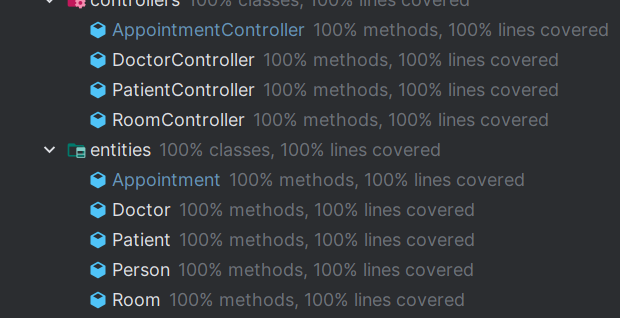
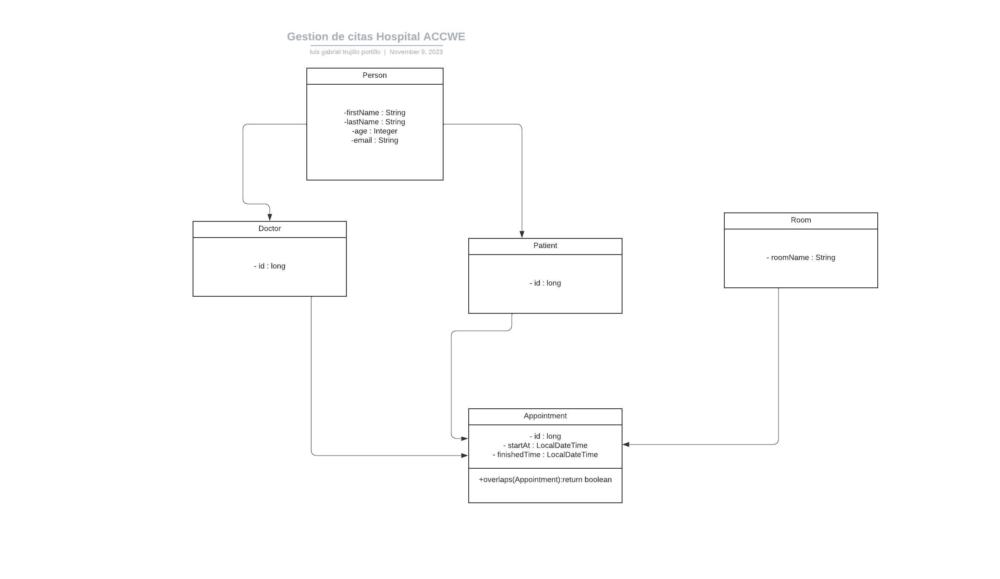

# java-template

# Versiones usadas: 

* Java 17.0.9
* Maven 3.8.7
* Docker 24.0.6

# Opciones para arrancar el programa

* usando docker con el comando mvn package 

# Test unitarios 

# Estructura de las clases del proyecto 
